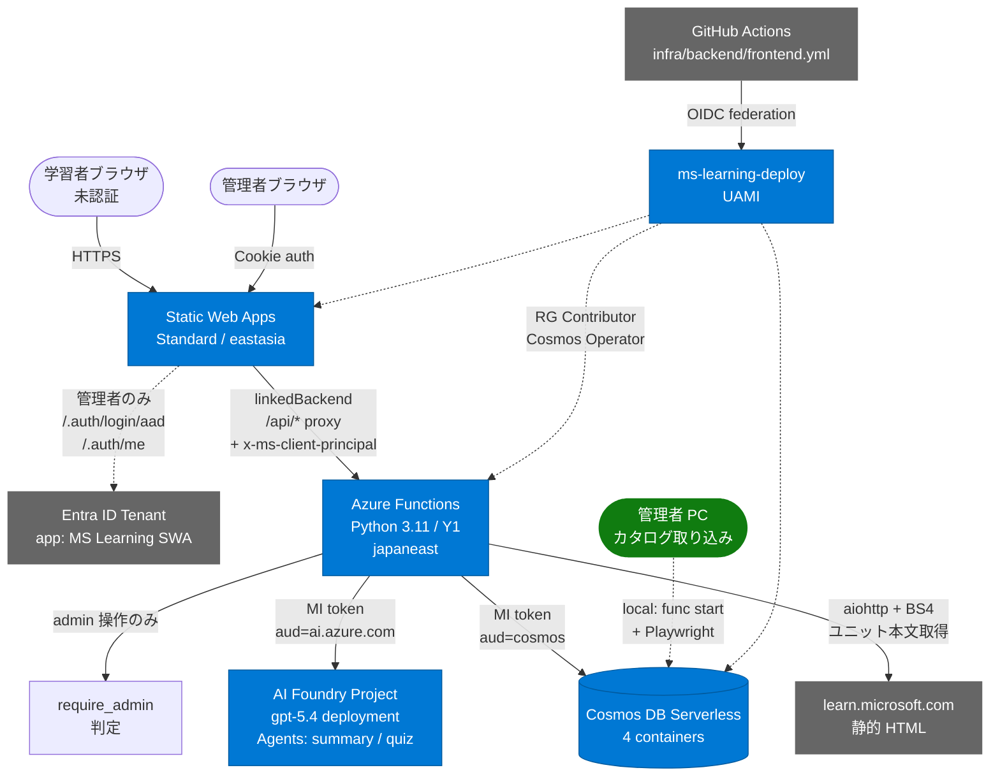
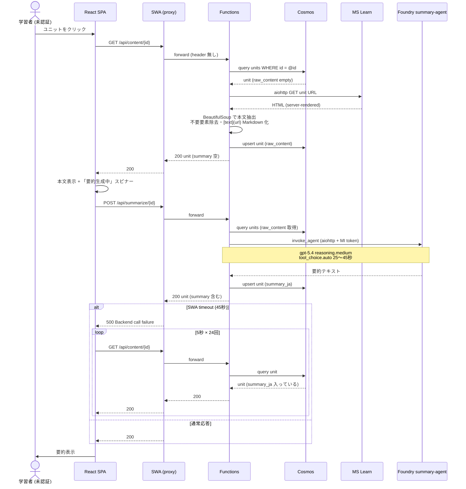
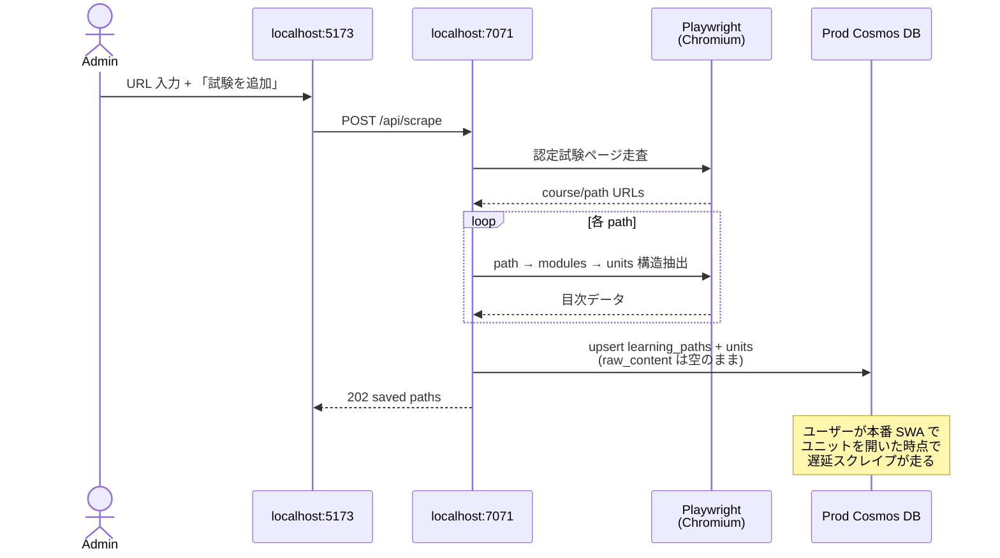
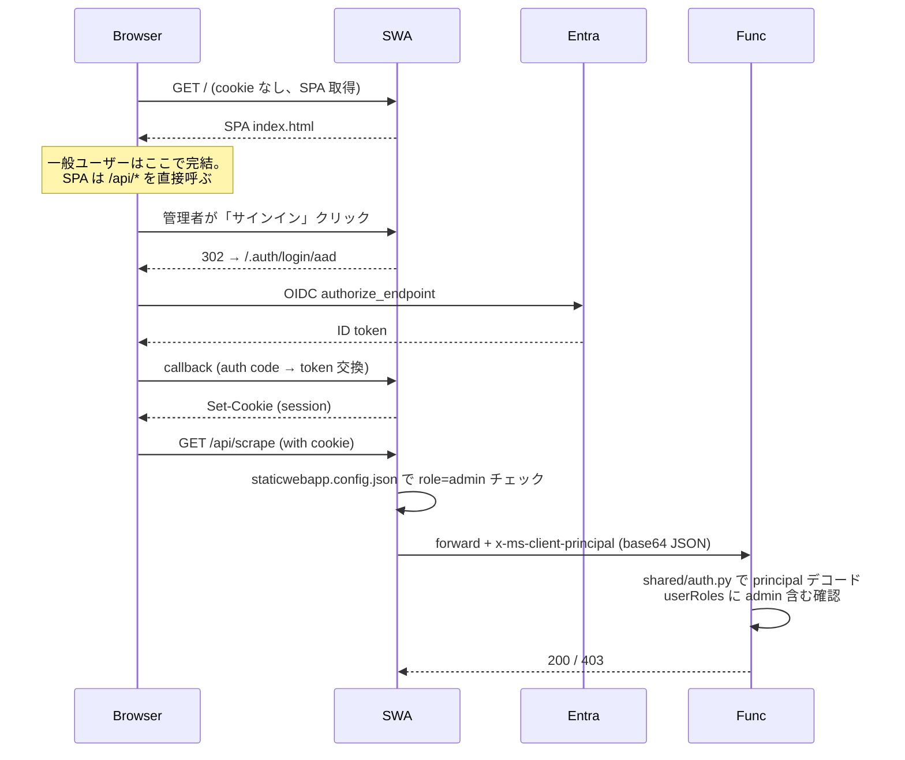
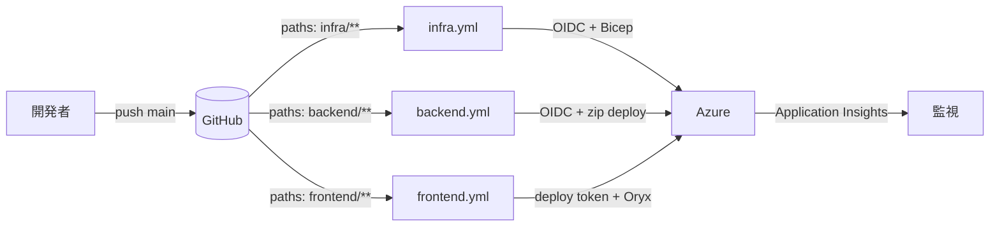

# Microsoft Learn 学習サポート IT アーキテクト向け技術解説

> 想定読者: コードレベルは問わないが、Azure / 認証 / サーバーレス / AI / IaC 等の技術用語を理解しているエンタープライズアーキテクト。アーキテクチャ判断とトレードオフ、ユーザー操作と裏側の挙動、セキュリティ設計を中心に解説します。
>
> 個別の技術用語の意味を確認したい場合は → [技術用語集 (glossary.md)](glossary.md) を参照してください。

---

## 1. 全体アーキテクチャ

### 1.1 採用スタック

| レイヤ | 採用技術 | 採用理由 |
|---|---|---|
| Frontend | React + Vite (TypeScript) on **Azure Static Web Apps Standard** | 静的配信 + 認証・ロール管理・linkedBackend が一体化。CDN グローバル配信 |
| Backend | **Azure Functions Python 3.11 / Linux Consumption Plan (Y1)** | アクセスに応じた 0→N オートスケール。アイドル時無料。**Playwright は不可** (Chromium バイナリ展開不可・RAM 1.5GB) |
| Database | **Azure Cosmos DB (NoSQL API, Serverless)** | RU 従量、低トラフィックで安価。disableLocalAuth でキー漏洩リスク排除 |
| AI | **Azure AI Foundry (gpt-5.4) Agents** | プロンプト・モデル・ツール定義を Foundry 側で管理、Function 側はエンドポイント呼び出しだけ |
| Identity | **Microsoft Entra ID (single tenant)** | **管理者ロール認証専用**（一般ユーザーは未認証で利用）。SWA 標準認証と統合 |
| Scraping | 本番: **aiohttp + BeautifulSoup** / 管理者ローカル: **Playwright (Chromium)** | MS Learn のユニット本文は静的 HTML で取得可、cert/exam/course ページは JS レンダリング必須 |
| Secrets | GitHub Encrypted Secret (env scope) + Function App Settings | KeyVault 相当の暗号化保管 |
| IaC | **Bicep** (`infra/main.bicep`) | ARM テンプレートより簡潔、Azure ネイティブ |
| CI/CD | **GitHub Actions + UAMI + OIDC federated credentials** | サービスプリンシパル secret 不要のパスワードレス |

### 1.2 リソーストポロジ



### 1.3 デプロイ単位

| ファイル変更 | 起動 Workflow | 主な操作 |
|---|---|---|
| `infra/**` | `infra.yml` | `az deployment group create` で Bicep 適用 |
| `backend/**` | `backend.yml` | `Azure/functions-action@v1` で Functions に zip deploy |
| `frontend/**` | `frontend.yml` | `Azure/static-web-apps-deploy@v1` で SWA に Oryx remote build + 配置 |

すべて `main` push トリガー、`environment: prod` スコープ。

---

## 2. ユーザー操作と裏側の動作（シーケンス図）

### 2.1 ユニットを開く（一般ユーザー・未認証・要約未生成）

`/api/*` は SWA route 設定で `["anonymous", "authenticated"]` 許可。Function App も `AuthLevel.ANONYMOUS` のため、未認証ブラウザからも到達できる。`x-ms-client-principal` ヘッダーは未認証時は付与されないが、本ルートでは `require_admin` を呼ばないので素通し。



### 2.2 クイズ生成

POST と GET の両方で同じパスを使う設計（GET はキャッシュ確認・生成しない）。タイムアウト時のポーリングは要約と同じ構造。

### 2.3 試験追加（管理者のみ・ローカル実行）

`/api/scrape` は SWA route で `allowedRoles: ["admin"]`、Function App 側でも `require_admin` でガード。カタログスクレイプ (cert/exam/course/path 各 URL 形式) は MS Learn の認定資格・コースページが JS レンダリング後にラーニングパスへのリンクを動的生成するため、ヘッドレスブラウザ (Playwright + Chromium) で実 DOM を解析する必要がある。Linux Consumption では Chromium バイナリの展開・メモリ要件を満たせないので、**管理者がローカル PC で `func start` を起動し、ブラウザの localhost:5173 から URL を投入する運用** とした。書き込み先は本番 Cosmos（`disableLocalAuth: true` のため az login で得た Entra トークンで認証）。



---

## 3. データ設計

### 3.1 Cosmos DB コンテナ

| コンテナ | パーティションキー | 主な属性 | 用途 |
|---|---|---|---|
| `learning_paths` | `/exam_id` | id, title, modules[{id, title, url, order, unit_count}], exam_id, exam_name | パス・モジュール構造のメタデータ |
| `units` | `/learning_path_id` | id, module_id, learning_path_id, title, url, order, raw_content, summary_ja, is_scraped, scraped_at | ユニット本文と要約 |
| `quizzes` | `/unit_id` | id, unit_id, module_id, question, choices[{key,text}], correct_key, explanation, generated_at | 4 択クイズ |
| `user_progress` | `/user_id` | id, user_id, learning_path_id, completed_units[], quiz_results[], total_score | ユーザー学習進捗 |

### 3.2 ID 生成ルール

スクレイプ時に決定的 ID を採用してアクセス効率と冪等性を確保:

- `learning_path_id` = MS Learn の path slug (例: `secure-identity-access`)
- `module_id` = `<path_id>-mod-NNN`
- `unit_id` = `<module_id>-unit-NNN`
- `quiz_id` = `quiz-<unit_id>-<rand8>` (1 ユニットに複数クイズが生成され得るため UUID 末尾)

### 3.3 キャッシュ戦略

| キャッシュレベル | 内容 | 無効化トリガー |
|---|---|---|
| カタログ (paths/modules/units 構造) | 1 回スクレイプして永続化 | 管理者の手動再実行 |
| ユニット本文 (raw_content) | 初回アクセス時に lazy fetch | 同上 |
| AI 要約 (summary_ja) | 初回アクセス時に Foundry 呼び出し | 管理者が `force=true` で再生成 |
| クイズ (quizzes) | 初回 POST 時に Foundry 呼び出し | 現状再生成 API 未提供 |

---

## 4. セキュリティ設計

### 4.1 認証ポリシー

本システムは **公開 Web** として運用しており、一般ユーザーは未認証で `/api/*` の GET / 要約 / クイズ生成にアクセス可能。Microsoft Entra ID 認証は **管理者ロール (`admin`) を取得するためだけ** に使う。

| アクター | 認証経路 | 行えること |
|---|---|---|
| 学習者（一般） | なし | 試験閲覧・本文取得・AI 要約生成・クイズ生成（既存キャッシュ + 初回生成） |
| 管理者 | SWA `/.auth/login/aad` → Entra ID single tenant → SWA セッション Cookie | 上記すべて + URL 投入によるカタログ scrape + ラーニングパスのタグ付け + 要約・クイズの強制再生成 (`force=true`) |

#### 管理者サインインフロー



### 4.2 認可マトリクス

| リソース | SWA route ガード (`staticwebapp.config.json`) | Function 側ガード (`require_admin`) | 備考 |
|---|---|---|---|
| `GET /api/exams` `learning-paths` `units/*` `content/*` | `["anonymous", "authenticated"]` | なし | 一般ユーザー用ルート |
| `POST /api/summarize/{id}` `quiz/{id}` | `["anonymous", "authenticated"]` | force=true のみ admin | 初回生成は誰でも、再生成は管理者 |
| `POST /api/scrape` | `["admin"]` | あり | 管理者のみ。本番では DISABLE_SCRAPE=true で 503 |
| `PATCH /api/learning-paths/*` | `["admin"]` | あり | 管理者のみ |
| `GET/POST /api/progress/{user_id}` | `["anonymous", "authenticated"]` | なし | **現状フロントは USER_ID="demo-user" ハードコードで全員共通**。Entra と紐付けた個別管理は未実装 (§8 参照) |

二重ガード: SWA 層で粗く弾き、Function 層で `x-ms-client-principal` を再検証。一般ユーザーは principal が無いまま到達するが、`require_admin` 不要のルートだけ通す設計。

### 4.3 機密情報の取り扱い

| クレデンシャル | 保管 | 利用箇所 |
|---|---|---|
| `AAD_CLIENT_SECRET` | GitHub Encrypted Secret (env: prod) → Bicep 経由で Function App App Setting | SWA 認証フロー内のサーバーサイドトークン交換 |
| `AZURE_STATIC_WEB_APPS_API_TOKEN` | 同上 | `frontend.yml` から SWA への deploy 用 |
| Cosmos アクセス | **secret なし** (MI + RBAC) | Functions runtime |
| Foundry agents 呼び出し | **secret なし** (MI + RBAC) | Functions runtime |
| Microsoft Learn スクレイプ | 認証不要 | aiohttp |

### 4.4 OIDC for CI/CD

サービスプリンシパルの client secret を一切持たない:

- UAMI `ms-learning-deploy` に federated credentials を 3 件登録
  - `repo:<owner>/<repo>:ref:refs/heads/main` (push to main)
  - `repo:<owner>/<repo>:pull_request` (PR)
  - `repo:<owner>/<repo>:environment:prod` (env scoped jobs)
- ロール:
  - RG Contributor (Functions / SWA / Storage / AI 各リソース管理)
  - Cosmos DB Operator (sqlRoleAssignment 操作のみ。データ操作権限ではない)

### 4.5 ネットワークと公開度

- SWA は public CDN 配信。**意図的に公開 Web として運用** している（学習コンテンツが MS Learn 公開情報の翻訳要約であり機密性が低いため）
- Function App は public endpoint (`mslearn-func.azurewebsites.net`)。EasyAuth は globalValidation を OFF にしている (アプリ側で principal ガード) ため直接アクセスも可能
- SWA からのアクセスは linkedBackend 経由で（管理者サインイン時のみ）`x-ms-client-principal` 注入される
- 直接 backend URL を叩いた場合、admin 必須の操作は `require_admin` が 403 を返すので、悪用リスクは「公開済み MS Learn 情報の AI 要約を閲覧される」程度に限定される
- AI 利用料が懸念なら同一ユニットへのリクエストはキャッシュで吸収される設計
- **社内限定運用へ寄せる場合の強化案**: SWA の `staticwebapp.config.json` を `["authenticated"]` 必須に変更、Private Endpoint + VNET Integration、Front Door + WAF + IP allowlist、EasyAuth strict mode 復活

### 4.6 ローカル開発の認証バイパス

| 環境変数 | 影響 | 本番設定 |
|---|---|---|
| `LOCAL_ADMIN_BYPASS=true` (backend) | `is_admin` が常に true | 本番では `false` |
| `VITE_LOCAL_ADMIN_BYPASS=true` (frontend) | SPA の useAuth が admin 扱い | `.env.local` (gitignore 済) |

ローカルでは `func start` + `npm run dev` の組み合わせで SWA 認証を経由せずに admin 機能をテスト可能。

---

## 5. ユーザビリティ設計

### 5.1 SWA linkedBackend 45 秒タイムアウトへの対処

Standard tier の linkedBackend にはデフォルト 45 秒の応答タイムアウトがあり、Enterprise tier 以外では変更不可。Foundry の summary/quiz エージェントは応答時間が変動 (25〜60 秒) し、しばしば 45 秒を超える。

採用した三層防御:

| 層 | 内容 |
|---|---|
| 1. **エンドポイント分離** | スクレイプ (HTTP, ~5秒) と AI 呼び出し (~30秒) を別ルートに。1 リクエストで両方は呼ばない |
| 2. **Foundry agent 最適化** | reasoning.effort: high → medium、tool_choice: required → auto。応答時間中央値が約 30% 短縮 |
| 3. **クライアントポーリング** | POST タイムアウト時、フロントが GET を 5 秒間隔 × 24 回 (約 2 分) ポーリング。サーバ側はタイムアウト後も処理継続して Cosmos に書き込むため、結果取得可能 |

**重要なプロパティ**: SWA がクライアント接続を切っても **Function App はリクエスト処理を続行**。Cosmos への書き込みは完了する。これを利用したポーリングなので、追加のキューやワーカーが不要。

### 5.2 スクレイピング設計（Playwright と Linux Consumption 制約への対応）

**Linux Consumption の制約**: Chromium バイナリ (200MB+) を展開できる十分なディスク領域がなく、起動時メモリも 1.5GB 上限。Playwright が要求する環境を満たせない。

**当初の実装**: 本文・カタログ問わず Playwright を使う前提だった → 本番では `DISABLE_SCRAPE=true` 環境変数で機能停止せざるを得ず、管理者がローカルで全ユニットを事前ロードして回る運用となり UX が破綻していた。

**現在の設計**: 「JS レンダリングが本当に必要な操作」と「静的 HTML で済む操作」を切り分けて、**本番から Playwright 依存を完全に排除** した。

| スクレイプ対象 | 手法 | 動作環境 | 備考 |
|---|---|---|---|
| 認定資格・試験・コースページ → ラーニングパス URL 抽出 | Playwright (Chromium) | **管理者ローカル PC のみ** | MS Learn の認定資格関連ページは JS で動的に関連リンクを生成するため、headless ブラウザが必須 |
| ラーニングパス → モジュール → ユニット 構造抽出 | Playwright | **管理者ローカル PC のみ** | 同上 |
| ユニット本文取得 | **aiohttp + BeautifulSoup** | **本番 Linux Consumption + ローカル両方** | 検証の結果、ユニットページは初期 HTML に本文が同梱されていることが判明。HTTP 取得 + DOM 解析で十分 |

**結果**:
1. 管理者がローカル PC で 1 回 URL を投入 → カタログ（試験・パス・モジュール・ユニット目次）が本番 Cosmos に保存
2. 一般ユーザーが本番 SWA でユニットを開いた瞬間に、Function App が aiohttp で本文を取得 → BeautifulSoup でクレンジング → Cosmos に保存 → Foundry で要約生成
3. 二度目以降は Cosmos のキャッシュから瞬時返却

`requirements.txt` には aiohttp と beautifulsoup4 のみ、Playwright は `requirements-dev.txt` に分離して本番イメージを軽量化（zip サイズ削減で `Sync Trigger Functionapp` の "malformed content" エラーも解消）。

### 5.3 進捗インジケータ

経過時間に応じて表示メッセージを段階的に変える `pickStep` 関数を採用:

```
0-6秒:    「① ユニット本文を取得しています…」
6-25秒:   「② AIエージェントが日本語要約を生成しています…」
25-60秒:  「③ もう少しで完了します…」
60秒+:    「④ まだ処理中です。通常は60秒以内に完了します…」
```

ユーザーに「動いている」「あとどれくらい」感覚を与える UX 工夫。

### 5.4 構造化エラーハンドリング

API 側は失敗時に `{"error": "<code>", "message": "<人間向け>"}` 形式の JSON を返す。フロント側は `error` コードで分岐し、専用 UI で案内する:

| error code | 状況 | UI |
|---|---|---|
| `content_not_cached` | スクレイプ無効化環境で本文未取得（現在は新スクレイパーで解消済み） | 黄色警告ボックス + HowToUse 案内 |
| `raw_content_missing` | 本文未取得で要約だけ呼ばれた | 自動的に GET /api/content から再開 |

---

## 6. スケーラビリティとコスト

### 6.1 スケール特性

| 層 | スケール戦略 | 上限 |
|---|---|---|
| SWA | グローバル CDN + 自動 | プラン上限の月間リクエスト |
| Functions Consumption | 0 → 200 インスタンス自動スケール | プラン上限 (一度に最大 200) |
| Cosmos Serverless | RU/s 自動 | コンテナごと 5000 RU/s |
| Foundry gpt-5.4 | デプロイメント TPM 5000 | スループット上限まで |

### 6.2 コスト構造

| リソース | 課金モデル | 月額目安 (低トラフィック) |
|---|---|---|
| SWA Standard | プラン固定 | $9 |
| Functions Y1 | 実行数 + GB-秒。1M 実行/400K GB-秒 無料 | ~$0 |
| Cosmos Serverless | RU 従量 + ストレージ | $1〜5 |
| Storage / AppInsights | LRS / 5GB 無料 | ~$1 |
| Foundry gpt-5.4 | 入出力トークン従量 | 利用量次第 |

ユニット 1 件あたり Foundry 呼び出し: 入力 6000 chars (~3000 token) + 出力 600 chars (~600 token) ≈ $0.03 想定 (gpt-5.4 概算)。1 ユニット 1 回キャッシュなので、再アクセスは無課金。

### 6.3 性能チューニング余地

- Foundry input length 削減 (現 6000 chars)
- gpt-5.4 → gpt-5-mini への切替（精度トレードオフ）
- reasoning.effort low (品質低下リスク)
- Cosmos の point read 化 (`/id` パーティションキー化)
- Functions Premium への移行で SWA タイムアウト解消

---

## 7. 監視と運用

### 7.1 観測性

| 観測対象 | 手段 |
|---|---|
| HTTP リクエスト・レスポンス | App Insights `requests` テーブル |
| 例外スタックトレース | App Insights `exceptions` |
| カスタムログ | Python `logger.info/warning/error` → traces |
| Foundry エージェント呼び出し時間 | カスタムログ + dependency tracking |
| Cosmos RU 消費 | Cosmos メトリクス |

KQL 例:

```kusto
exceptions
| where timestamp > ago(1h)
| project timestamp, outerMessage, operation_Name
| order by timestamp desc
```

### 7.2 デプロイパイプライン



`prod` environment による required reviewers でゲート可能（現状は無効）。

### 7.3 災害復旧

| 障害 | 復旧手順 |
|---|---|
| Function App / SWA リソース消失 | Bicep を再デプロイ → CI/CD で実装再配置 |
| Cosmos データ破損 | Azure 標準ポイントインタイムリストア (8 時間 / 30 日) |
| Foundry エージェント停止 | Azure Foundry portal でリストアまたは agent 再作成 |
| Entra アプリ登録消失 | 再登録 → Bicep 内の `aadClientId/Secret` 更新 |

---

## 8. 既知の制約とトレードオフ

| 項目 | 制約 | 採用判断 |
|---|---|---|
| カタログ scrape は Playwright 必須 | Linux Consumption で動かない | 管理者ローカル実行で割り切り。常時稼働する処理ではないため許容 |
| SWA Standard timeout 45 秒固定 | tier 変更以外で延長不可 | エンドポイント分割 + ポーリングで実用化 |
| Function App public endpoint | EasyAuth 緩めで直接アクセス可 | `require_admin` での gating + 学習コンテンツは機密でないため許容 |
| **SWA を公開 Web として運用** | 誰でも閲覧・AI 要約生成可能 | MS Learn 公開情報の翻訳要約のためコンテンツ機密性は低い。AI 利用料はキャッシュで吸収。社内限定にする場合は §4.5 強化案へ |
| **進捗データの個別管理が未実装** | フロントが `USER_ID="demo-user"` ハードコードで全ユーザー共通 | Demo・PoC レベルの実装。本番運用では Entra 認証導入 + `clientPrincipal.userId` 紐付けが必要（追加開発数日規模） |
| 管理者サインインは Entra single tenant のみ | iCloud / GitHub / 個人 MSA 不可 | 管理者は組織テナント所属のみで運用。一般ユーザー閲覧は影響なし |
| Foundry gpt-5.4 高 TPM 必要 | 同時実行多数で limit に当たる可能性 | キャッシュで再呼び出し回避 |
| Cosmos Serverless RU 上限 | コンテナ 5000 RU/s | 現状余裕、必要時 Provisioned に切替 |

---

## 9. アーキテクチャ拡張ロードマップ

### 9.1 短期 (1〜2 週間)

- **進捗データの個別化**: SPA で `clientPrincipal.userId` を取得し API ルートに渡す。Cosmos `user_progress` のパーティションを実 user に変更
- **カタログ scrape のクラウド移行**: Container Apps Job (Playwright 同梱イメージ) で実行 → 管理者ローカル PC 不要
- **社内限定運用に切替（必要なら）**: `staticwebapp.config.json` の `/api/*` を `["authenticated"]` 必須に変更 + Entra 招待フロー
- 弱点分野自動分析 (KQL ベースの集計エンドポイント追加)

### 9.2 中期 (1〜3 ヶ月)

- Private Endpoint + VNET 化 → backend 直接アクセス遮断
- Foundry agents の本番テナント分離（dev/staging/prod）
- 模擬試験モード (Cosmos Vector Search で関連ユニット抽出)
- Functions Premium 移行 → SWA timeout 制約緩和、cold start 解消

### 9.3 長期

- マルチテナント化 (Entra B2B + テナント別 Cosmos partition)
- AWS / GCP 認定試験対応 (スクレイパーのプラグイン化)
- AI モデルの動的選択（試験種別に応じて gpt-5.4 / o3-mini など切替）

---

## 10. リファレンス

| トピック | 場所 |
|---|---|
| Bicep 定義 | [infra/main.bicep](../infra/main.bicep) |
| 認証ヘルパ | [backend/shared/auth.py](../backend/shared/auth.py) |
| Foundry エージェント呼び出し | [backend/shared/foundry_agent.py](../backend/shared/foundry_agent.py) |
| ユニット本文 HTTP scraper | [backend/scraping/ms_learn_scraper.py](../backend/scraping/ms_learn_scraper.py) `scrape_single_unit_http` |
| 二段階呼び出しフロント実装 | [frontend/src/pages/UnitPage.tsx](../frontend/src/pages/UnitPage.tsx) `generateSummaryWithFallback` |
| デプロイ手順 | [docs/deployment.md](deployment.md) |
| 管理者運用手順 | [HowToUse.md](../HowToUse.md) |
| Cosmos 設計 | [docs/cosmos_db_design.md](cosmos_db_design.md) |
| Foundry agent 仕様 | [docs/foundry-agents.md](foundry-agents.md) |
