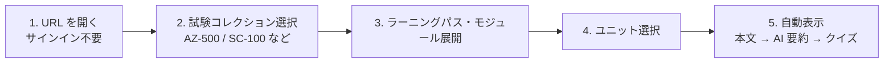
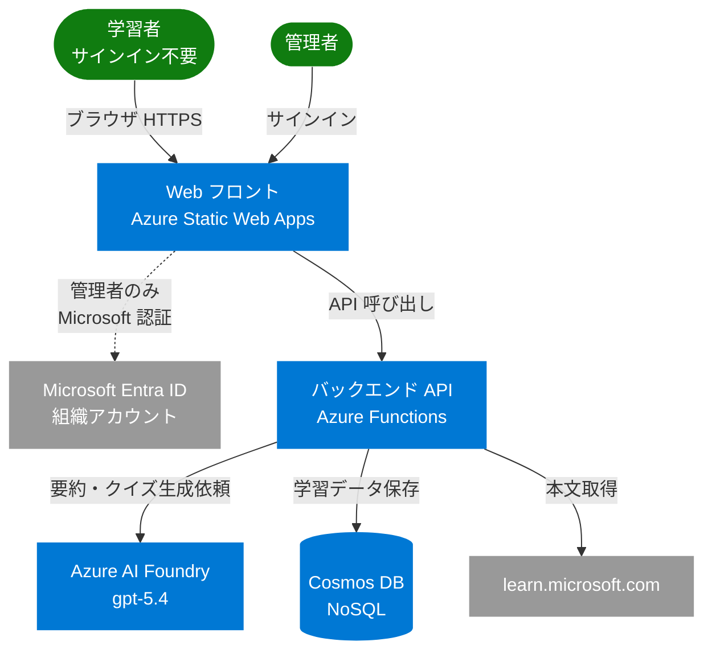
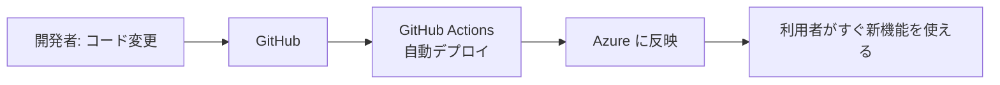

# Microsoft Learn 学習サポート 管理者向け報告書

> 想定読者: 技術詳細は不要だが、システム全体の目的・効果・セキュリティ・運用コストを把握したい管理職・意思決定者。
>
> 不明な技術用語が出てきたら → [技術用語集 (glossary.md)](glossary.md) を参照してください。

---

## 1. 何を作ったか（要約）

Microsoft 認定試験 (AZ-500 / SC-100 / SC-300 / AZ-700 など) の公式学習サイト「Microsoft Learn」のラーニングパスを取り込み、**生成 AI が日本語で要約と確認クイズを自動生成する Web アプリ** を Azure 上に構築しました。

学習者はブラウザで URL を開くだけ（**サインイン不要**）で、機械翻訳臭の強い Microsoft Learn の本文を、シニアエンジニア視点の自然な日本語に圧縮された要約として読めます。さらに各ユニットに対する 4 択問題が自動的に生成され、理解度を即座にチェックできます。

新しい試験コンテンツの取り込みや AI 要約の再生成といった運用操作は **管理者専用機能** として分離されており、Microsoft Entra ID で認証した管理者ロールの操作者のみが実行できます。

---

## 2. 解決する課題と期待効果

### 課題

| 観点 | 従来の問題 |
|---|---|
| 言語 | Microsoft Learn の日本語版は機械翻訳が中心で読みにくい。専門用語が原語と日本語訳で揺れる |
| 学習効率 | 1 ユニット数千文字を全部読んで要点を自分で抽出する必要があり、時間がかかる |
| 定着確認 | 各ユニットに簡易な確認問題はあるが、試験形式の 4 択問題はモジュール末尾だけ |
| 試験頻出ポイント | どこが本試験で問われやすいかは別途過去問や解説書で勉強する必要がある |

### 効果

| 観点 | 改善内容 |
|---|---|
| 言語 | プロのエンジニアが書き直した自然な日本語 (400〜600 字) で要点把握 |
| 学習効率 | 1 ユニットの読了時間を 1/3 〜 1/5 程度に短縮 |
| 定着確認 | 各ユニットに 4 択 ×3 問の AI 生成クイズ。間違えた選択肢の解説付き |
| 試験対策 | 要約内に「★試験ポイント」マーカーを挿入し、本試験頻出論点を明示 |

---

## 3. ユーザーが触る画面

### 3.1 一般学習者の操作（サインイン不要）

学習者の操作は事実上クリックのみ。AI による解析・要約・問題生成はすべて裏側で自動的に進行します。一度開いたユニットは結果がデータベースにキャッシュされるため、二度目以降は瞬時に表示されます。

### 3.2 管理者の操作（Microsoft Entra ID サインインが必要）

学習者が普段触る画面とは別に、コンテンツを充実させるための管理者操作があります。サインインすると以下が追加で操作可能になります:

- 新しい試験 URL の投入（Microsoft Learn から取り込み）
- ラーニングパスへの試験タグ付け
- 既存ユニットの AI 要約を再生成（Foundry エージェントの設定変更後に最新版へ更新したい時など）

管理者操作は当面、運用担当者がローカル PC からまとめて実行する想定です（後述の制約参照）。

---

## 4. 全体アーキテクチャ（高レベル図）

**主要 Azure サービス**:

| 役割 | サービス | 説明 |
|---|---|---|
| Web フロント | Static Web Apps | グローバル CDN で配信される SPA |
| バックエンド API | Functions | リクエストに応じて自動起動するサーバーレス API |
| データベース | Cosmos DB (Serverless) | 学習コンテンツとユーザー進捗を保管 |
| AI | Azure AI Foundry | 自然な日本語要約・クイズ生成エージェント |
| 認証 | Entra ID | Microsoft 365 と同じ認証基盤 |

すべて Azure マネージドサービスを採用しており、サーバーの面倒見・パッチ適用は不要です。

---

## 5. セキュリティの考え方

### 5.1 認証と権限

本システムは **公開 Web アプリ** として運用しており、学習者の閲覧・AI 要約・クイズ生成にはサインイン不要です。一方、コンテンツ運用に関わる操作は管理者専用に分離しています。

| 操作 | サインイン |
|---|---|
| 試験コレクション・ユニットの閲覧 | **不要** |
| AI 要約の生成 / クイズ生成 | **不要** (一度生成された結果はキャッシュされ全員で共有) |
| 試験 URL の投入・スクレイピング | 必要 (Microsoft Entra ID + admin ロール) |
| 既存パスのタグ変更・要約の強制再生成 | 必要 (同上) |

管理者操作には **組織の Microsoft Entra ID テナント所属ユーザー** であり、かつアプリ側で `admin` ロールが付与されていることが必要です。iCloud / Gmail などの個人アカウントでは管理者操作はできません（一般閲覧は誰でも可能）。

### 5.2 機密情報の管理

| 機密情報 | 用途 | 保管場所 |
|---|---|---|
| AI へのアクセス権 | バックエンドが Foundry を呼ぶ時 | Azure マネージド ID (パスワード不要、Azure 内部認証) |
| データベース接続 | 同上 | 同上 |
| 管理者認証用シークレット | Entra ID で管理者がサインインする時のサーバ側トークン交換 | Azure 側の安全な構成領域 (Application Settings) |
| デプロイ用の鍵 | GitHub Actions が Azure にデプロイする時 | GitHub Encrypted Secret + 環境スコープ |

すべての機密情報は **コードに書かれていません**。漏洩リスクのある場所には保管されていません。

### 5.3 通信暗号化

すべての通信は HTTPS / TLS で暗号化されています。データベース、AI、ブラウザ間のすべて。

### 5.4 データ保護

- Cosmos DB は **キーベース認証を無効化** し、Entra ID 認証のみ受け付けます。万が一接続文字列が漏れても、それだけでは不正アクセスできません
- AI が生成した要約・クイズは **誰が見ても同じ内容** が返るキャッシュ前提の設計（個人情報は格納しません）
- **学習進捗データの個人別保存は現状ダミー実装**（全ユーザー共通の ID で集約）。利用シーンが個人別の進捗管理を必要とする段階で、Entra ID と紐づけた個別保存に切り替える計画です。詳細は §8 リスク表を参照

---

## 6. 運用とコスト

### 6.1 月額コスト見積（低トラフィック前提）

| 項目 | 概算月額 |
|---|---|
| Static Web Apps (Standard) | 約 $9 (約 1,400 円) |
| Functions / Storage / 監視 | 約 $1 |
| Cosmos DB (Serverless) | $1〜5 (利用量次第) |
| AI Foundry (gpt-5.4) | 利用回数次第 (要約 1 回 = 約 $0.05〜0.10 想定) |
| **合計** | **約 $10〜20 + AI 利用量** |

スケーラビリティはクラウドの自動スケール機能に任せており、利用者数が増えても運用作業は不要です（料金は使用量に比例して増えます）。

### 6.2 開発・更新の流れ

開発者がコードを修正すると、GitHub への変更投稿だけで以下が自動的に進みます:

人手の作業は不要、確認用のテスト環境への自動展開も可能です。

### 6.3 監視と障害対応

- Azure Application Insights が稼働状況とエラーを常時記録
- 異常発生時はアラート通知設定が可能（メール / Teams など）
- Cosmos DB は Azure 標準のバックアップで 30 日まで遡って復元可能

---

## 7. 今後の発展可能性（提案）

| 案 | 期待効果 |
|---|---|
| 弱点分野の自動分析 | 過去のクイズ結果から「ID 管理」「ネットワーク」など弱点カテゴリを可視化、復習推奨 |
| 模擬試験モード | 複数モジュール横断で本試験形式の問題を出題 |
| 他言語試験への対応 | AZ-500 だけでなく他社認定 (AWS / GCP) も同じ仕組みで取り込み可能 |
| 学習グループ機能 | 社内勉強会で進捗共有・ランキング表示 |
| メール/Teams 通知 | 「今日の 1 ユニット」を毎朝配信 |

---

## 8. リスクと現状の制約

| リスク | 内容 | 対処状況 |
|---|---|---|
| AI 応答時間 | 要約・クイズ生成に 30〜60 秒かかる | 進捗表示 + バックグラウンド処理で待ち時間を体感的に短縮 |
| 公式サイト構造変更 | Microsoft Learn の HTML 変更で取り込みが壊れる可能性 | 監視で検知、構造変更時は管理者がコード修正 (1〜2日想定) |
| AI 利用料の高騰 | 利用者増加で AI 料金が想定超過 | キャッシュにより同一ユニットは 1 回しか AI を呼ばない設計で抑制 |
| コンテンツ初回投入は管理者操作 | 新試験のコンテンツ追加は管理者がローカル PC から実行 | 一度投入すれば一般ユーザーは普通に使える |
| 学習進捗の個別管理が未実装 | 現状すべてのユーザーが同じ ID で進捗を共有しており、個人ごとの正答率追跡ができない | 個別管理が必要になった段階で Entra ID と紐づけて分離する追加開発（数日規模）|
| 公開 Web のため誰でも閲覧可能 | アクセス制限なしで世界中から API 経由でも要約取得可 | 学習コンテンツ自体は Microsoft Learn の公開情報なので機密性は低い。社内限定にしたい場合はアクセス制御を追加する必要あり |

---

## 9. まとめ

- **学習効率を 3〜5 倍に高めるための、AI 駆動の Microsoft 認定試験対策ツール**を構築しました
- 学習者は **サインイン不要** で URL を開くだけで利用可能。AI 要約とクイズが自動生成される
- 管理者操作（コンテンツ取り込み・要約再生成）のみ Microsoft Entra ID 認証で保護
- すべて Azure マネージドサービスで構築されており、運用負荷は最小
- バックエンドから AI / DB への通信は **マネージド ID によるパスワードレス認証** を採用
- 月額コスト数千円規模から開始可能、利用量に応じて自動スケール
- GitHub への変更投稿だけで本番反映される自動化済み

ITアーキテクト向けの詳細仕様は [report-for-architects.md](report-for-architects.md) を参照してください。
